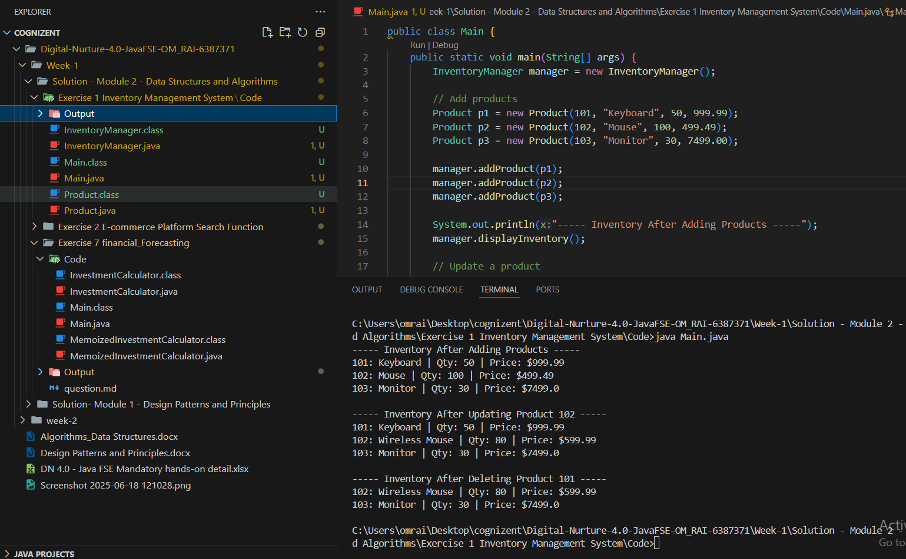

# Terminal 
 javac Main.java 
 
 java Main.java
# Output

# Explain why data structures and algorithms are essential in handling large inventories

Data structures and algorithms are essential in handling large inventories because they provide efficient ways to store, organize, search, update, and manage data. As inventory size grows, basic approaches become too slow or memory-intensive. Efficient data structures (like HashMap, TreeMap, or ArrayList) help in quickly accessing and modifying product details, while proper algorithms ensure operations like sorting, searching, or filtering are done optimally. Without them, tasks like finding a product, checking availability, or updating quantities could take much longer, leading to delays, errors, and poor system performance. They are key to building a scalable, fast, and reliable inventory system.

# Discuss the types of data structures suitable for this problem

HashMap (HashMap<Integer, Product>)

✅ Best for fast lookup, update, and delete operations using productId as the key.

Time Complexity: O(1) for add, search, and delete (average case).

Ideal when each product has a unique identifier.