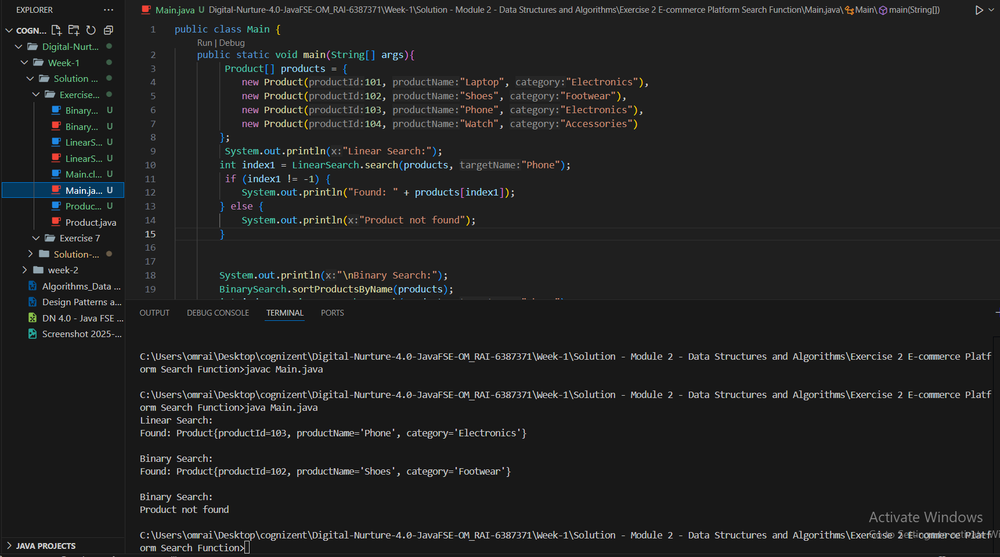

# Terminal 
 Javac Main.java 
 
 Java Main.java
 
# output

# Explain Big O notation and how it helps in analyzing algorithms.
 Big O notation is a mathematical way to describe the efficiency of an algorithm in terms of how its time or space requirements grow as the input size increases. It provides an upper bound on performance, helping to compare and analyze algorithms for scalability and efficiency. By focusing on the growth rate (ignoring constants and lower-order terms), Big O allows developers to predict how an algorithm will behave with large inputs, making it easier to choose the most suitable algorithm for a given problem.

# Describe the best, average, and worst-case scenarios for search operations.

Best, Average, and Worst-Case Scenarios in Search Operations
Best Case: The desired element is found at the very beginning (or in the most optimal spot), resulting in the minimum number of comparisons.
Example: In linear search, finding the element at the first index — O(1) time.

Average Case: The element is found somewhere in the middle, assuming all positions are equally likely or based on a probability distribution.
Example: In linear search, the average number of comparisons is n/2, which is O(n).

Worst Case: The element is not found or is found at the last possible position, requiring the maximum number of comparisons.
Example: In linear search, if the element is not present or is last — O(n) time.

For binary search on a sorted array:

Best Case: Element is at the middle — O(1)

Average & Worst Case: Repeatedly halve the search space — O(log n)

