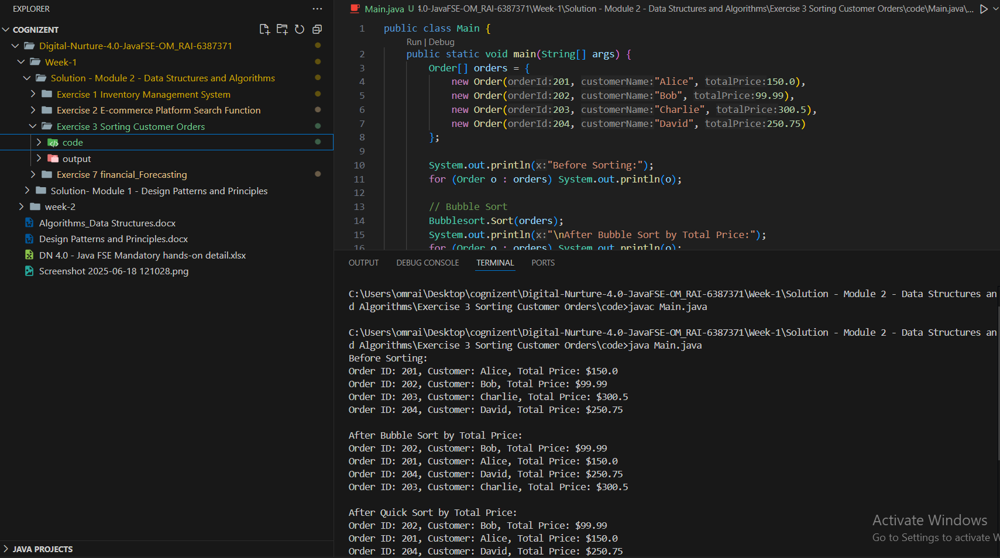

# Terminal 
javac Main.java

java Main.java

# Output 

# Explain different sorting algorithms (Bubble Sort, Insertion Sort, Quick Sort, Merge Sort).

✅ Bubble Sort
Repeatedly compares adjacent elements and swaps them if they’re in the wrong order.

Time Complexity: O(n²)

Easy to implement, but inefficient for large data.

✅ Insertion Sort
Builds the sorted array one element at a time by inserting into the correct position.

Time Complexity: O(n²)

Efficient for small or nearly sorted datasets.

✅ Quick Sort
Uses divide and conquer; chooses a pivot and partitions the array.

Time Complexity: O(n log n) on average, O(n²) worst-case.

Fast and widely used in practice.

✅ Merge Sort
Divides the array, sorts each half, and merges them.

Time Complexity: O(n log n)

Stable and predictable, good for linked lists and large arrays.