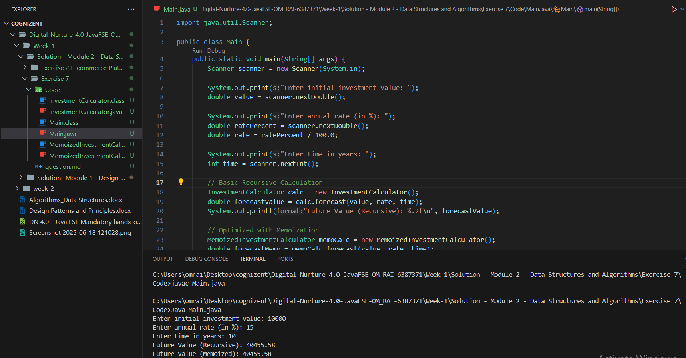

# Terminal 
 Javac Main.java 
 
 Java Main.java
 
# Output

# 	Explain the concept of recursion and how it can simplify certain problems.
Recursion is a programming technique where a function calls itself to solve smaller instances of a problem until it reaches a base case, which stops the recursion. It simplifies problems by breaking them down into simpler subproblems of the same type, making the code cleaner and easier to understand, especially for problems with repetitive or nested structure like factorial calculation, tree traversal, or solving mazes. Recursion is particularly useful when a problem can be naturally defined in terms of smaller versions of itself, allowing elegant solutions where iterative logic might be complex or messy.

# Explain how to optimize the recursive solution to avoid excessive computation.
To optimize a recursive algorithm, you mainly aim to reduce repeated computations and improve memory usage. Here are the key techniques:

Use Memoization (Top-Down Dynamic Programming) ->Store the results of already computed subproblems in a cache (usually a hashmap or array), so they don’t need to be recalculated.

Use Tabulation (Bottom-Up Dynamic Programming)-> instead of recursion, build the solution iteratively from the base cases up.

