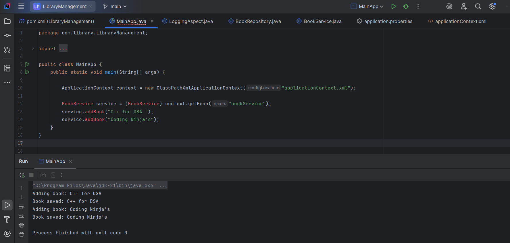

# Exercise 5: Configuring the Spring IoC Container
 ## Scenario: 
The library management application requires a central configuration for beans and dependencies.
## Steps:
1.	Create Spring Configuration File:

    o	Create an XML configuration file named applicationContext.xml in the src/main/resources directory.
    o	Define beans for BookService and BookRepository in the XML file.
2.	Update the BookService Class:

    o	Ensure that the BookService class has a setter method for BookRepository.
3.	Run the Application:

    o	Create a main class to load the Spring context and test the configuration.

# Exercise 6: Configuring Beans with Annotations
## Scenario: 
You need to simplify the configuration of beans in the library management application using annotations.
## Steps:
1.	Enable Component Scanning:

    o	Update applicationContext.xml to include component scanning for the com.library package.

2.	Annotate Classes:

    o	Use @Service annotation for the BookService class.
    o	Use @Repository annotation for the BookRepository class.

3.	Test the Configuration:

    o	Run the LibraryManagementApplication main class to verify the annotation-based configuration.

# Output

**For code part please refer the code folder in 2.libraryManagement**

## Run application output 

