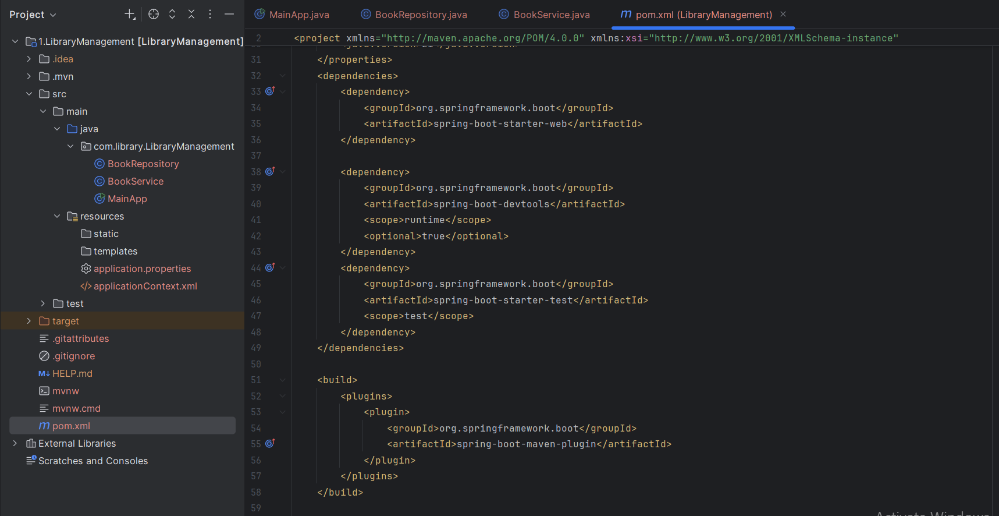
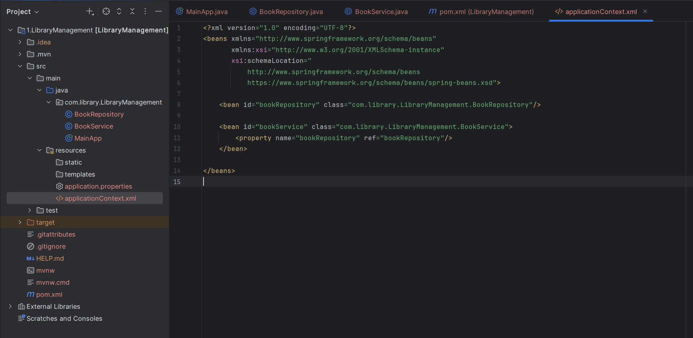
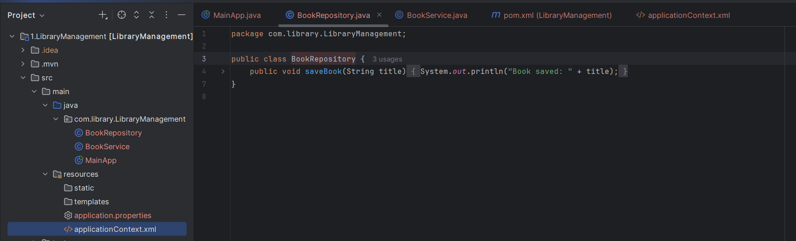
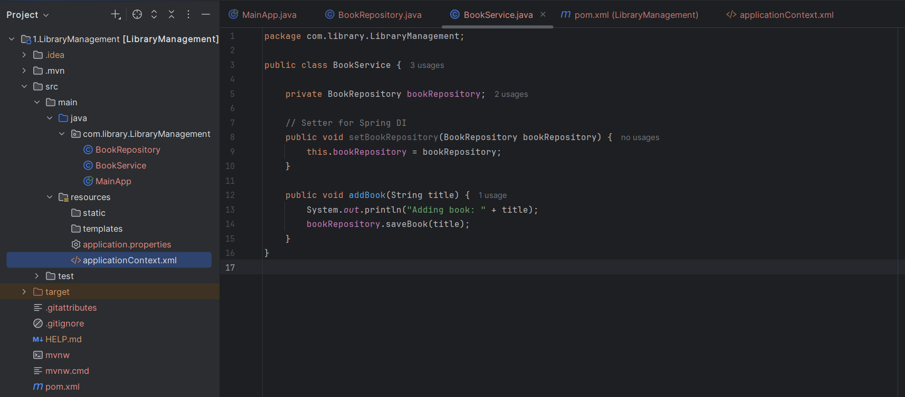
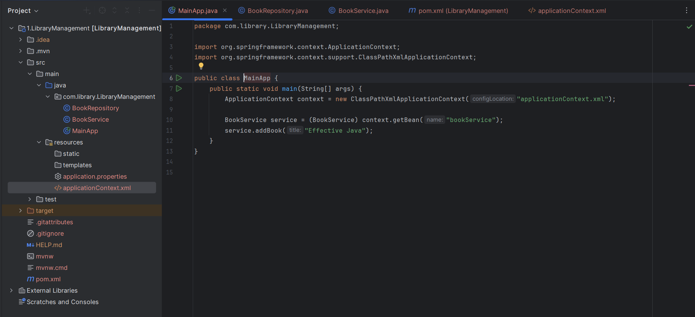
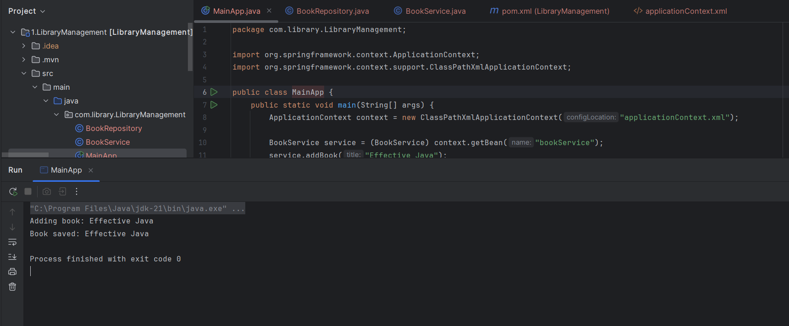

# Exercise 1: Configuring a Basic Spring Application

**Code :** 
        
        For code please refer to the Code folder under : 
        
        Week-3\Module 5 - Spring Core and Maven\LibraryManagement\Code

**Scenario:**

Your company is developing a web application for managing a library. You need to use the Spring Framework to handle the backend operations.
Steps:
1.	Set Up a Spring Project:

         o	Create a Maven project named LibraryManagement.

         o	Add Spring Core dependencies in the pom.xml file.

**Output 1** 

2.	Configure the Application Context:

        o	Create an XML configuration file named applicationContext.xml in the src/main/resources directory.

        o	Define beans for BookService and BookRepository in the XML file.

**Output 2** 

3.	Define Service and Repository Classes:

        o	Create a package com.library.service and add a class BookService.

        o	Create a package com.library.repository and add a class BookRepository.

**Output 3** 

4.	Run the Application:

        o	Create a main class to load the Spring context and test the configuration.

**Output 4** 

**Output 5: Final ouptut on running the Program** 

