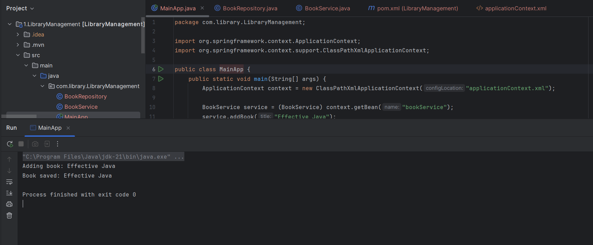

# Exercise 2: Implementing Dependency Injection

**Code :** 
        
        For code please refer to the Code folder under : 

        Week-3\Module 5 - Spring Core and Maven\LibraryManagement\Code

**Scenario:**

In the library management application, you need to manage the dependencies between the BookService and BookRepository classes using Spring's IoC and DI.

Steps:
1.	Modify the XML Configuration:

        o	Update applicationContext.xml to wire BookRepository into BookService.
**Output 1**

2.	Update the BookService Class:

        o	Ensure that BookService class has a setter method for BookRepository.

**Output 2**

3.	Test the Configuration:

        o	Run the LibraryManagementApplication main class to verify the dependency injection.
        
**Output 3**

