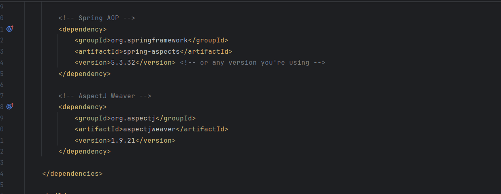
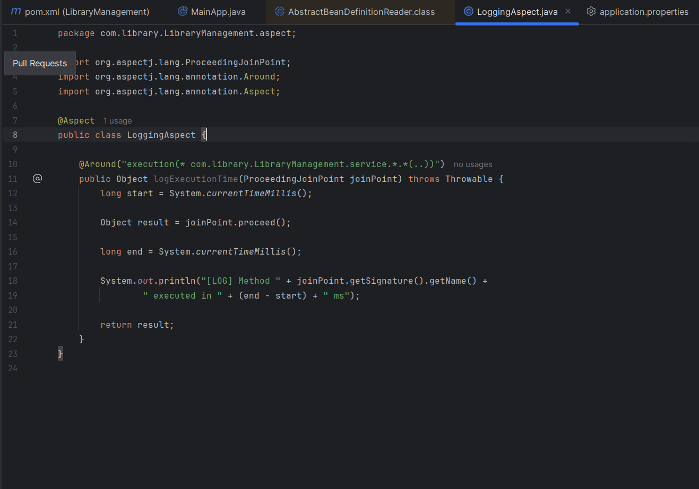
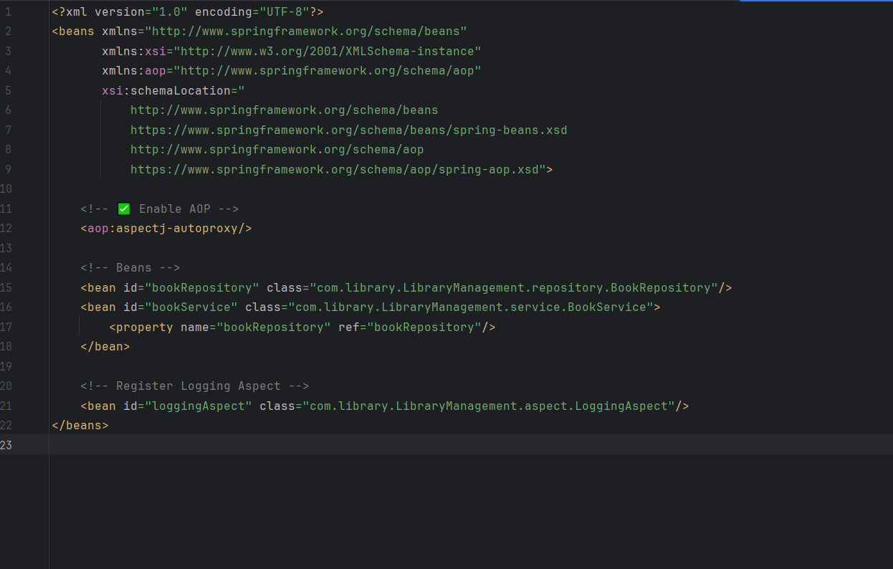
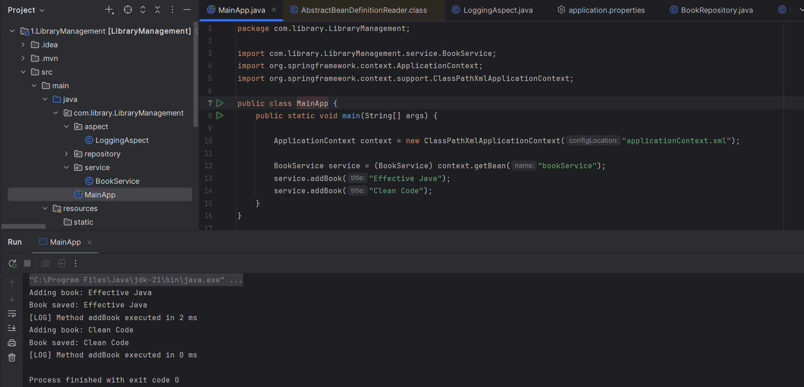

# Scenario: 
The library management application requires logging capabilities to track method execution times.
## Steps:

1.	Add Spring AOP Dependency:

     o	Update pom.xml to include Spring AOP dependency.
  
    
2.	Create an Aspect for Logging:

     o	Create a package com.library.aspect and add a class LoggingAspect with a method to log execution times.

     

3.	Enable AspectJ Support:

      o	Update applicationContext.xml to enable AspectJ support and register the aspect.

4.	Test the Aspect:
    o	Run the LibraryManagementApplication main class and observe the console for log messages indicating method execution times.

