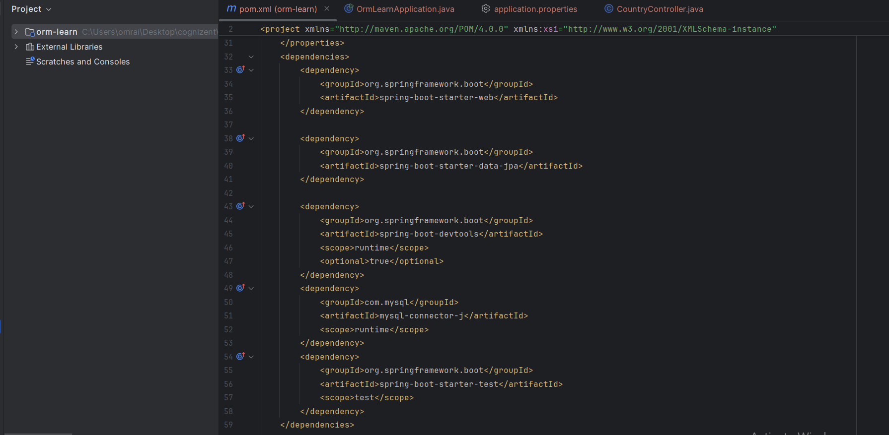
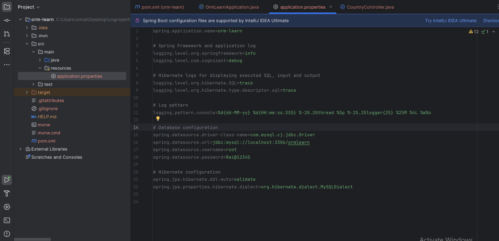
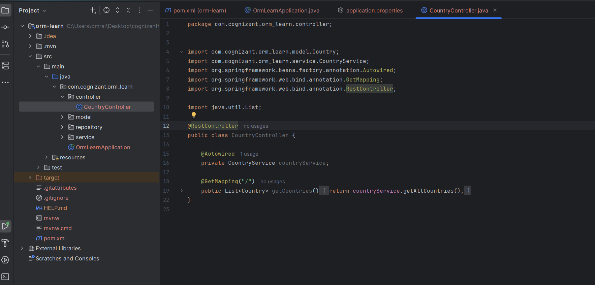
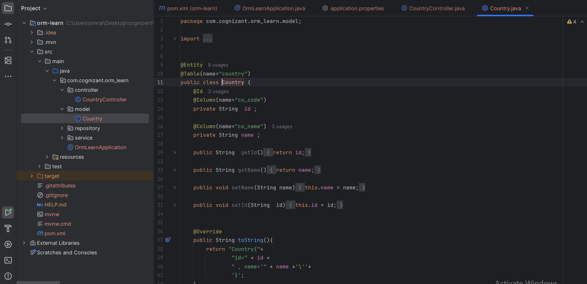
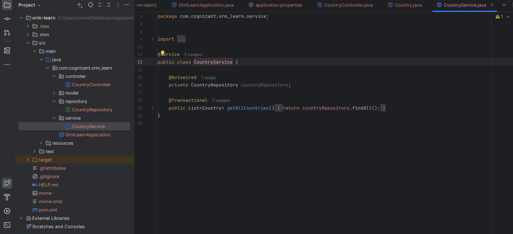
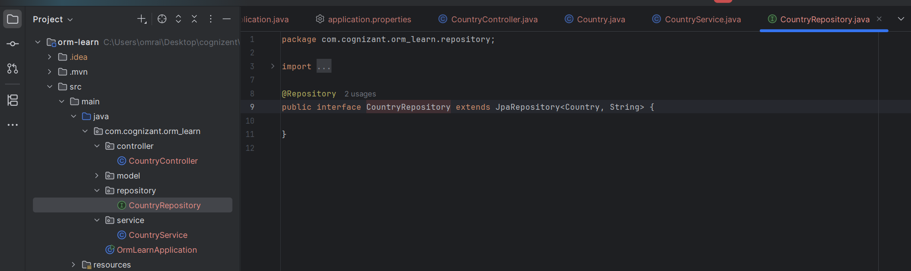
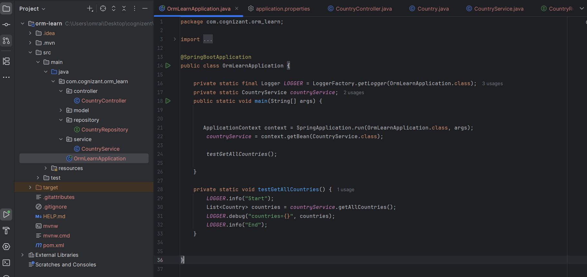
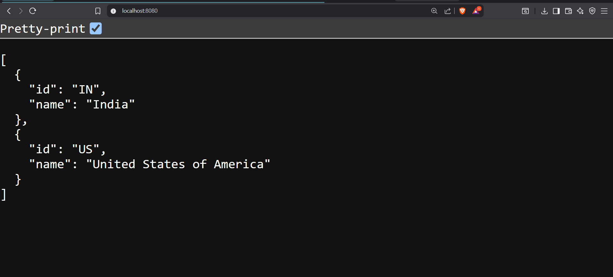

**Dependencies for the poject**

**application.properties**

**Controller/CountryController**

**model/Country**

**service/CountryService**

**Repository**

**OrmLearnApplication.java**

**Run Appication Output** 

