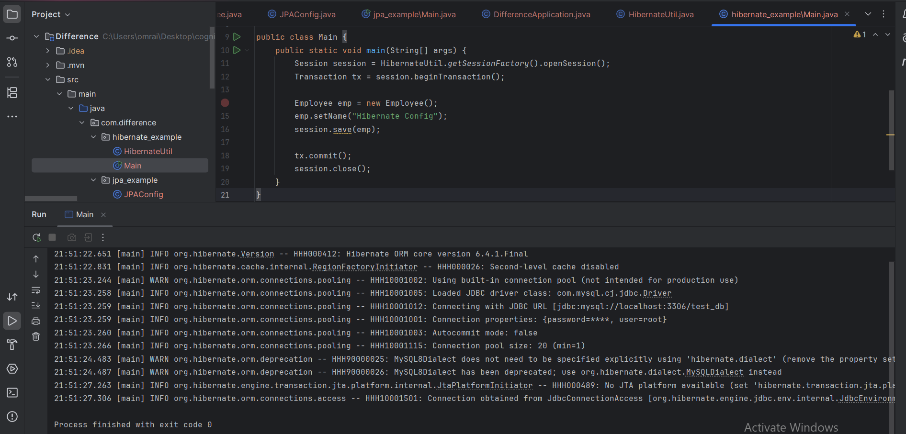
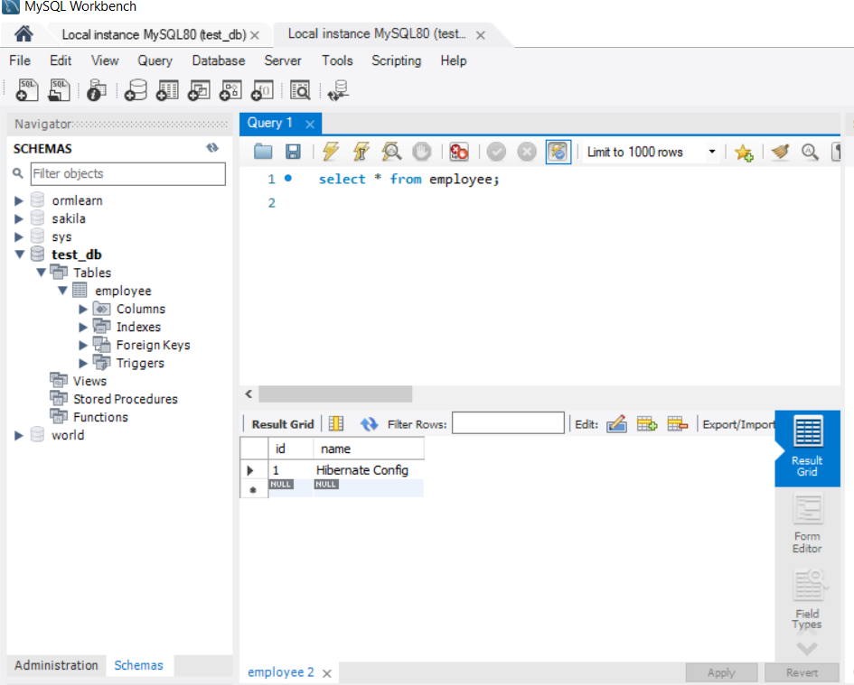
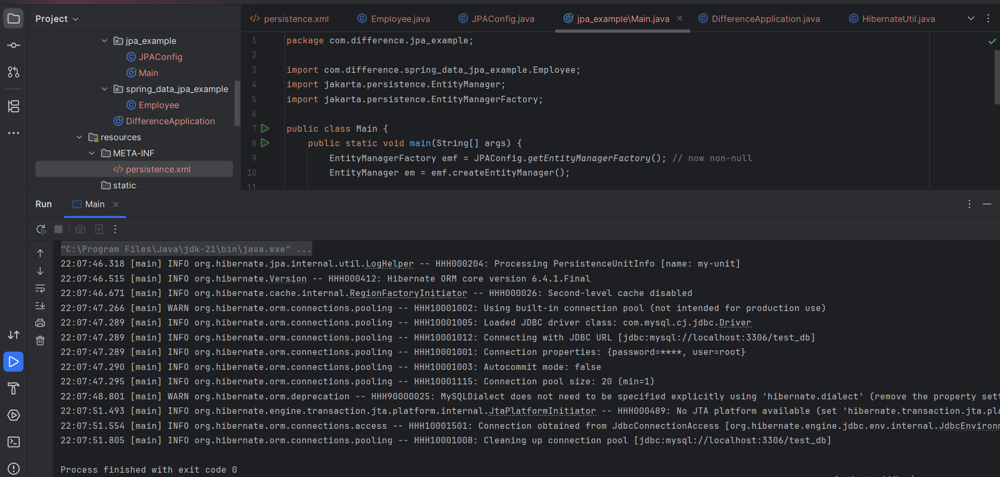
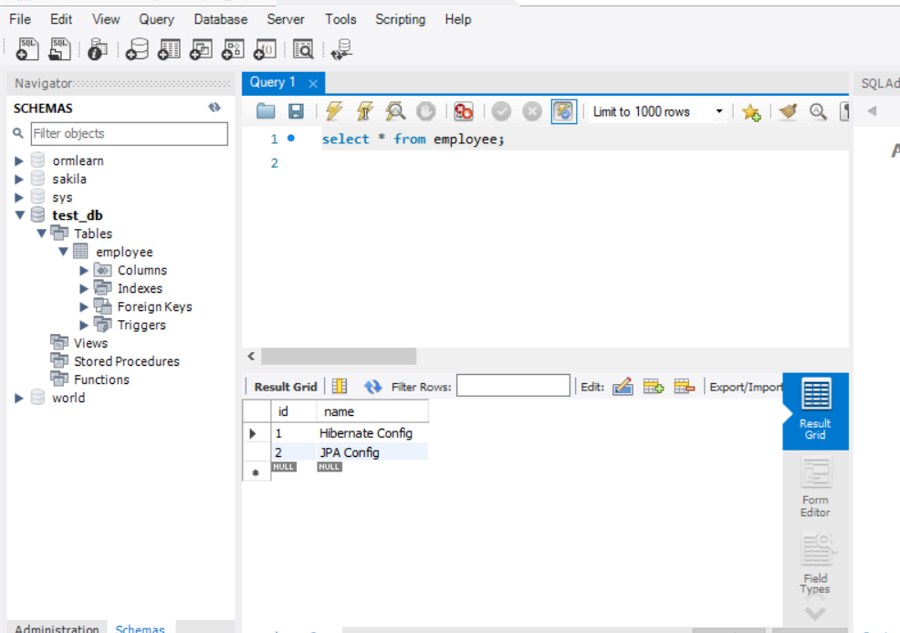

# Code 

### For code part go to : 
#### Week-3 -> Module 6-spring data Jpa with hibernate -> code  -> Differene  folder 

## Hibernate execution output 

## New record added in sql table employee 

s

## JPAConfig execution output 

## New record added in sql table employee 
