# Implement services for managing Country 

An application requires for features to be implemented with regards to country. These features needs to be supported by implementing them as service using Spring Data JPA.

# • Find a country based on country code 

->Added the new service in countryService i.e getCountry 

 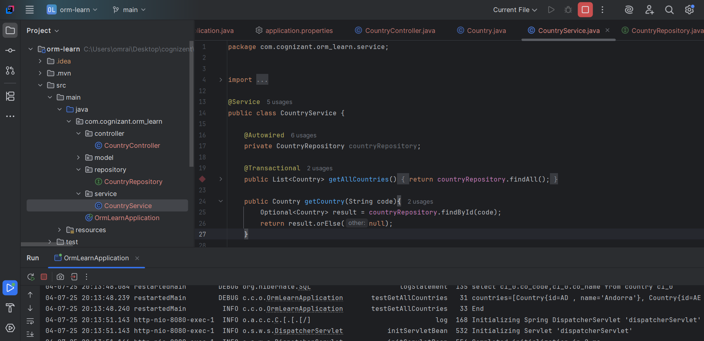

->Added new path controller in controller to map our request to server 

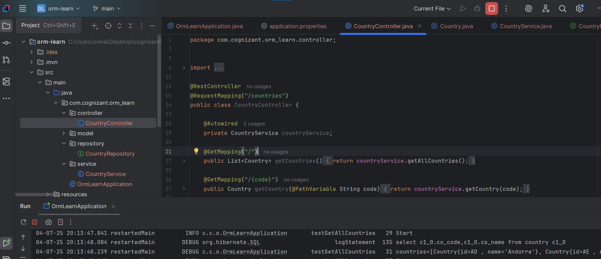

-> test Output of searching country by code 

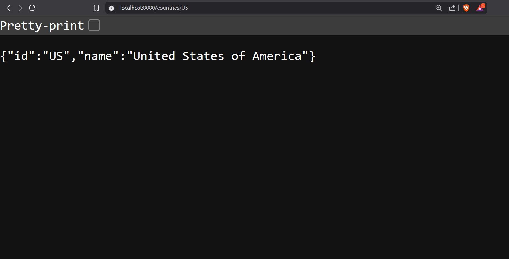

# • Add new country

-> add Service added 
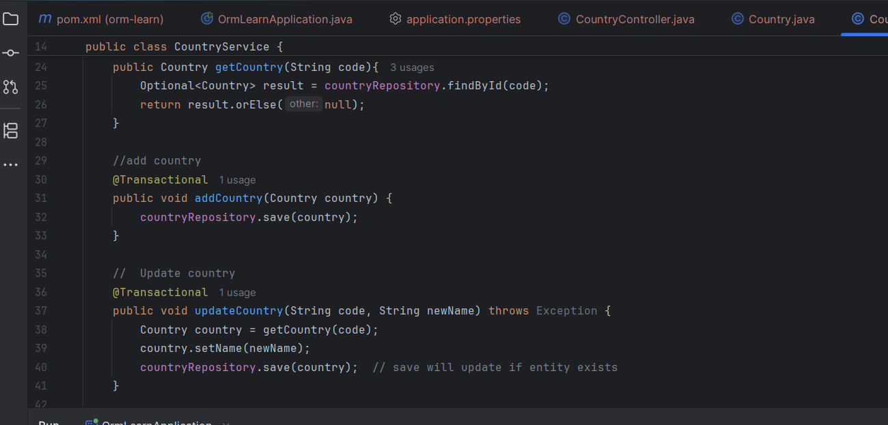 

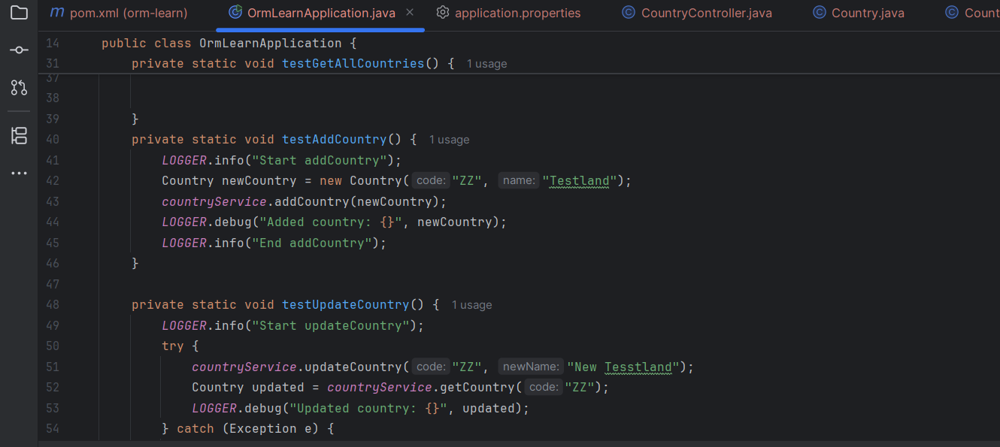

-> Adding country result 
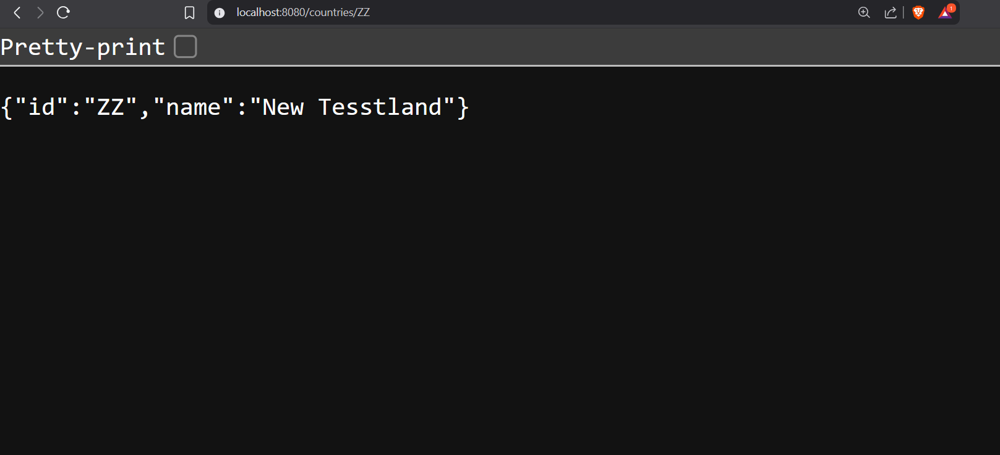
# •	Update country

-> added the update service to country service 

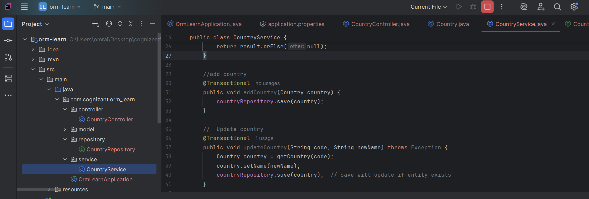

-> updating the country name 

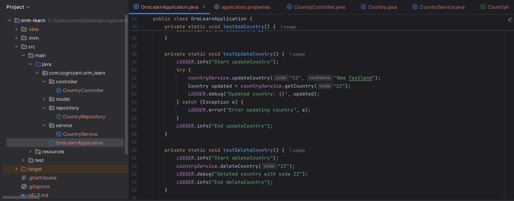

-> Run application again , country name successfully updated from India to Bharat 

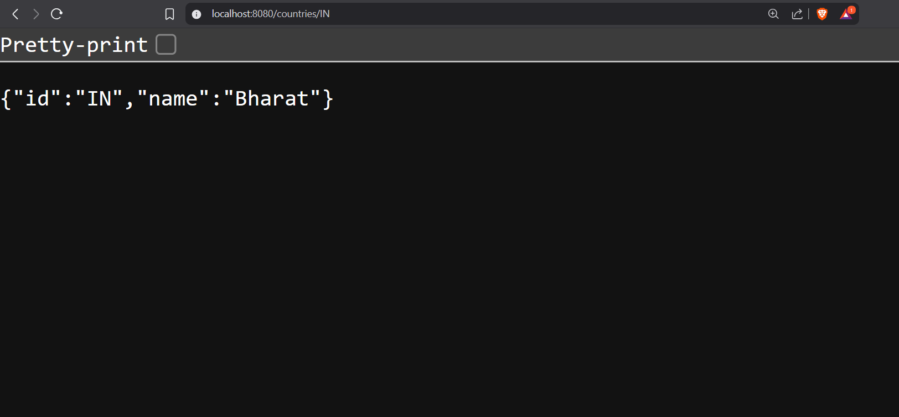

# •	Delete country

-> new delete service 
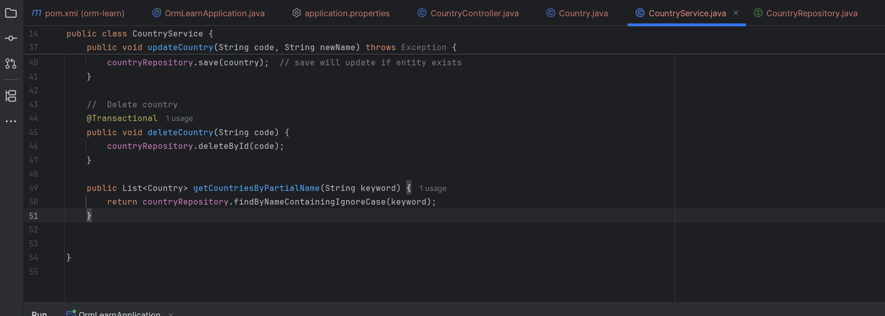 

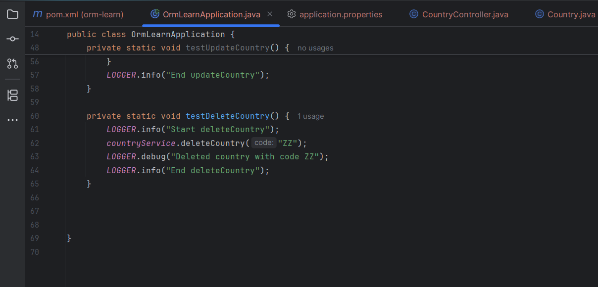

-> Deletion result - black  screen 
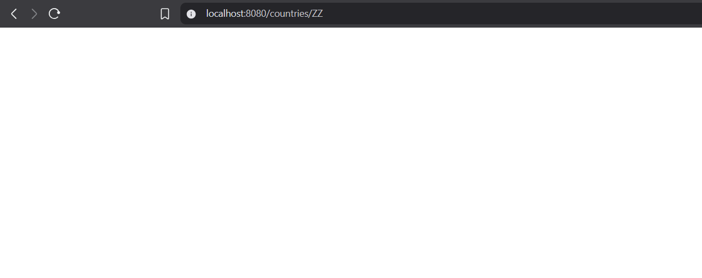

# •	Find list of countries matching a partial country name

-> create new mapping in controller 

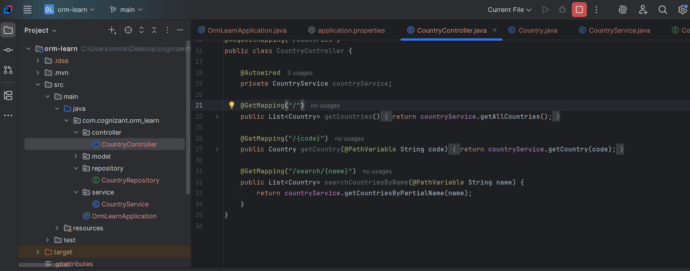

-> add method to countryRepository

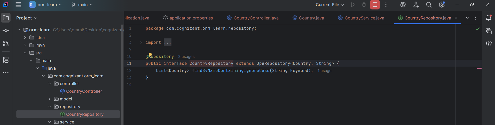

-> add new service 

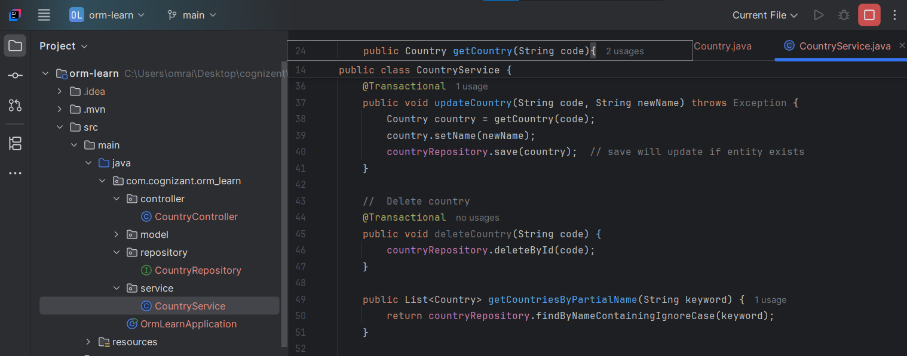

-> test output 
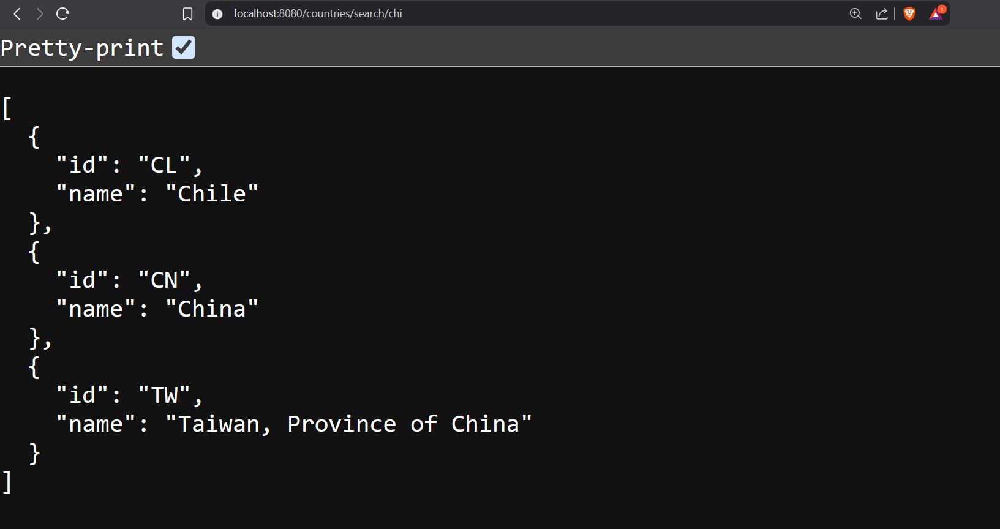