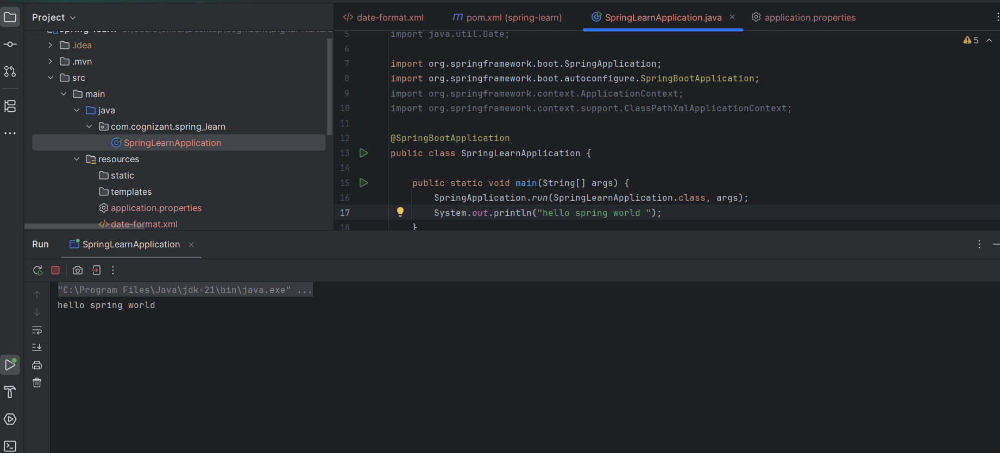
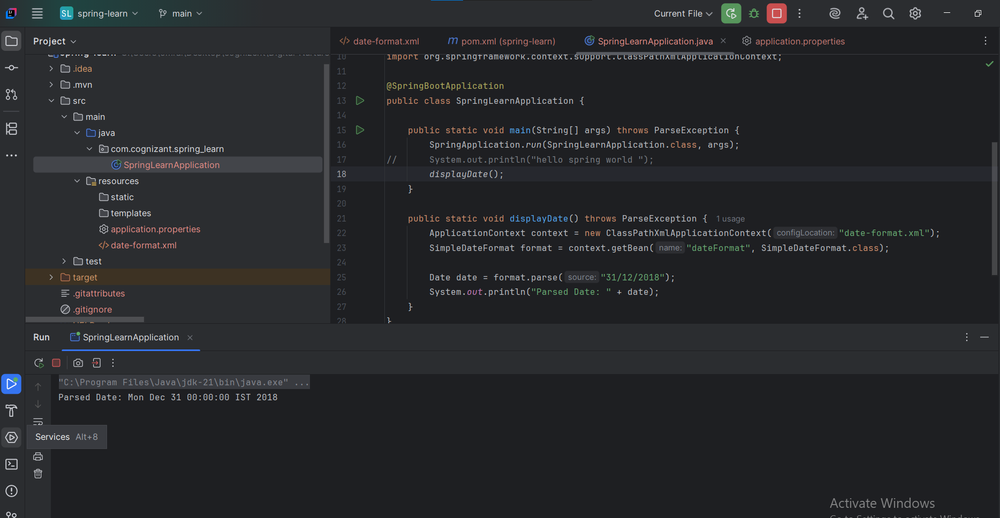
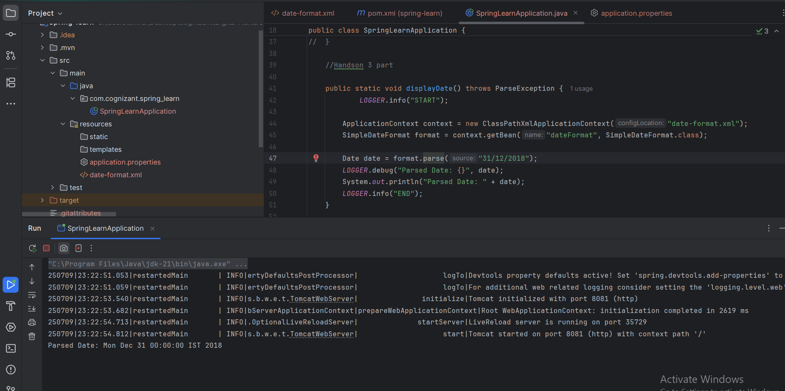
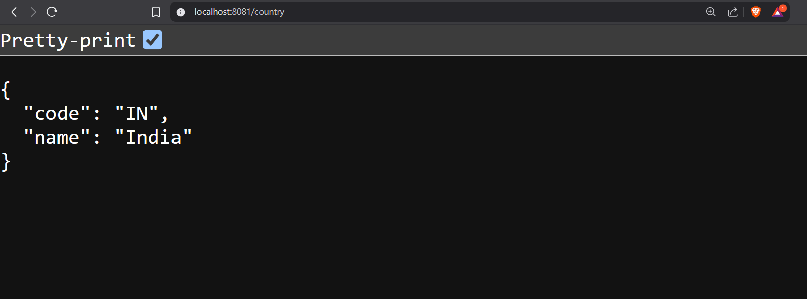
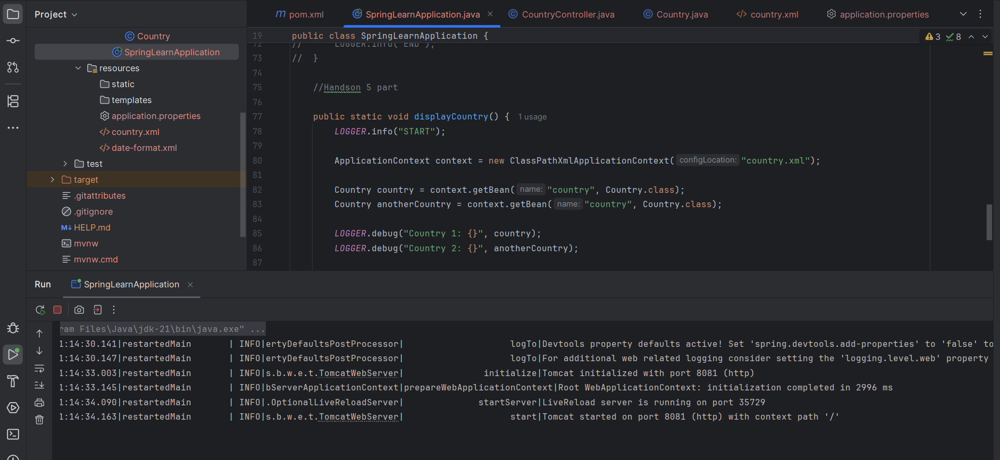
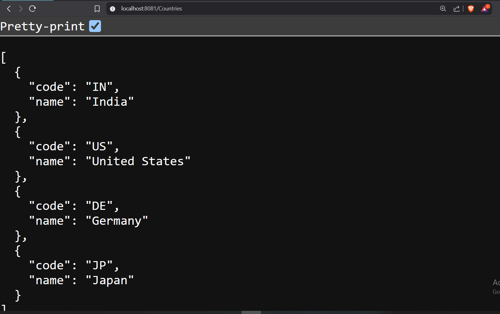

# code : 

 Refer code from Code folder under Week-4/Modue 7 -spring Rest using spring Boot3/Code/Sping-learn .

## Handson 1 OUTPUT 

## Handson 2 OUTPUT

## Handson 3 OUTPUT 

## Handson 4 OUTPUT

## Handson 5 OUTPUT

## Handson 6 OUTPUT

