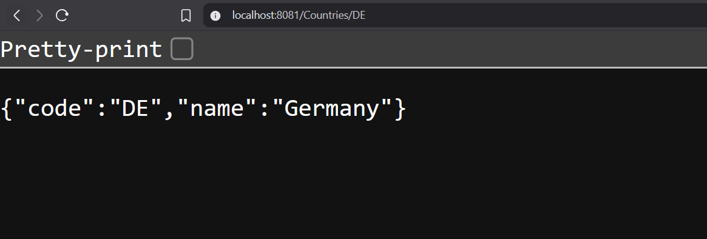
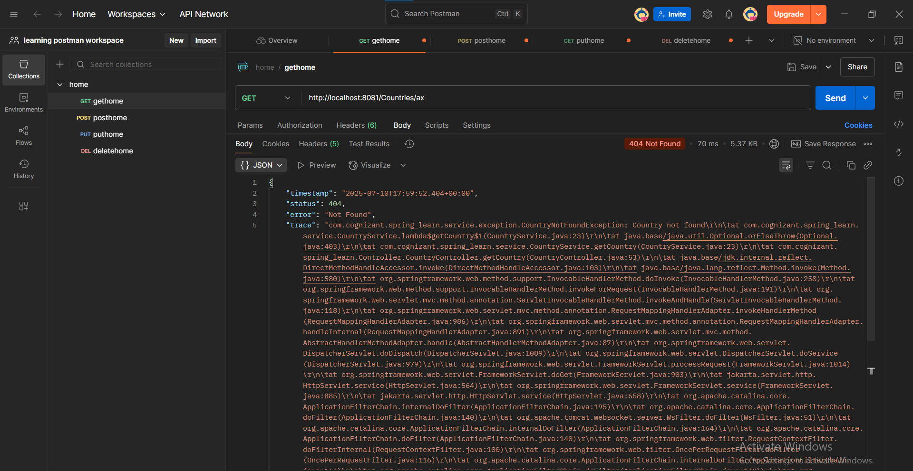
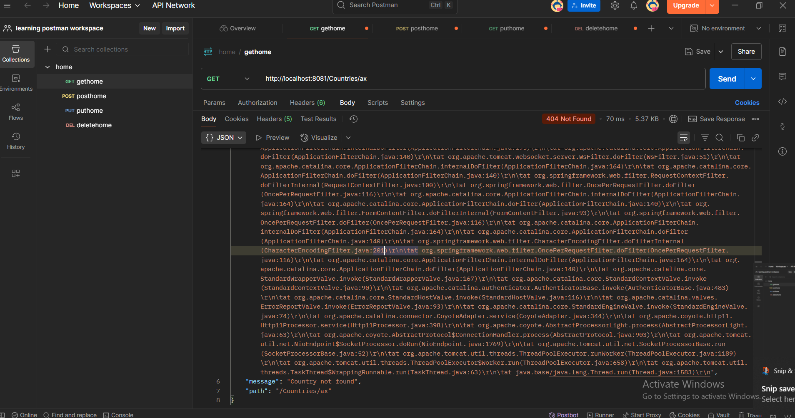

# code : 

 Refer code from Code folder under  
 <b>Week-4/Modue 7 -spring Rest using spring Boot3/Code/Sping-learn .

 ## Get country based on country code 

## REST - Get country exceptional scenario 

getting expection for unknown country code 

