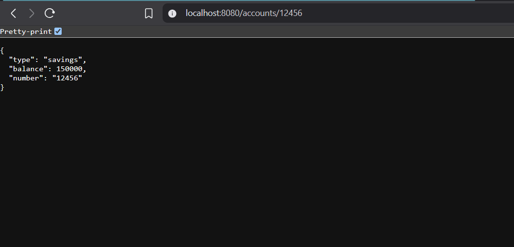
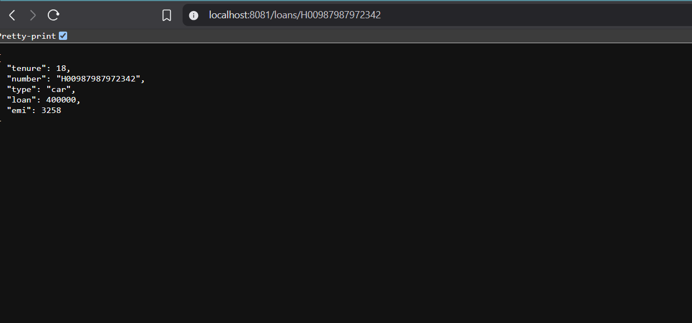

# Code 1 : Accounts 

Refer the account folder under 

### Digital-Nurture-4.0-JavaFSE-OM_RAI-6387371\Week-5\Module 8 - Microservices with Spring Boot 3 and Spring Cloud\2_ Microservices_With_API_Gateway\code\microservices\account

## Web Output 

# Code 2 : Loans 

Refer the loan folder under 

### Digital-Nurture-4.0-JavaFSE-OM_RAI-6387371\Week-5\Module 8 - Microservices with Spring Boot 3 and Spring Cloud\2_ Microservices_With_API_Gateway\code\microservices\loan 

## Web Output 
