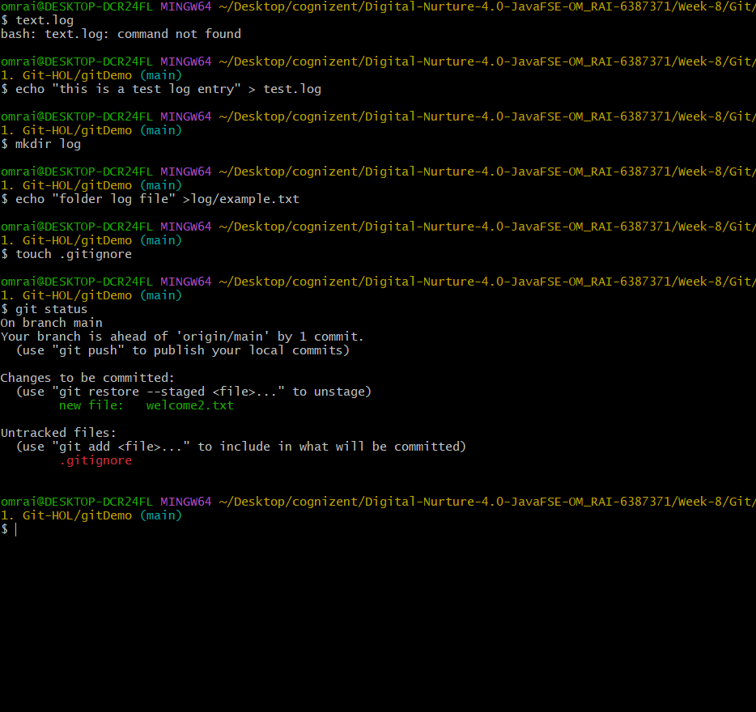

## For the repo part to the 1.Git-HOL

 

Open .gitignore and add:
# Ignore all .log files
*.log

# Ignore the log folder
log/

result - no log file show in status to add in the main brach of the gitDemo repo
