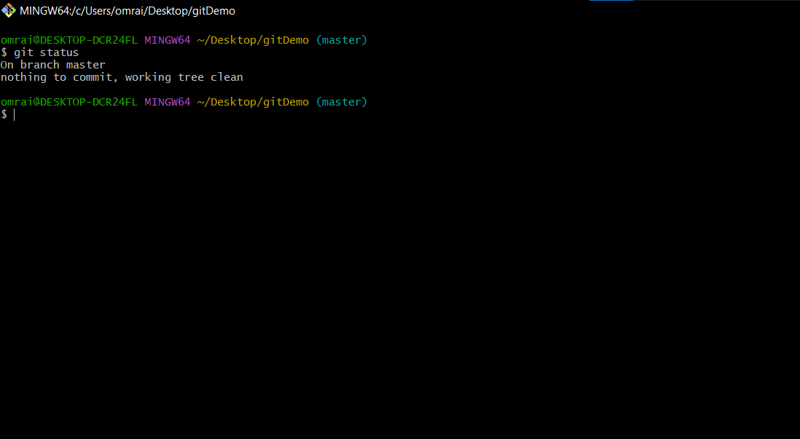
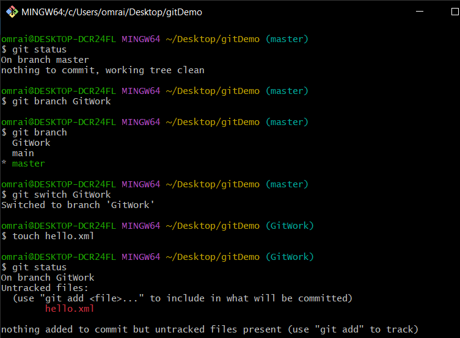
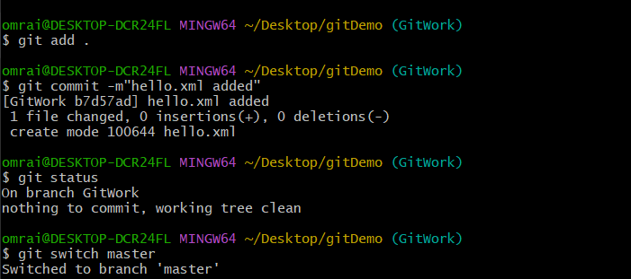
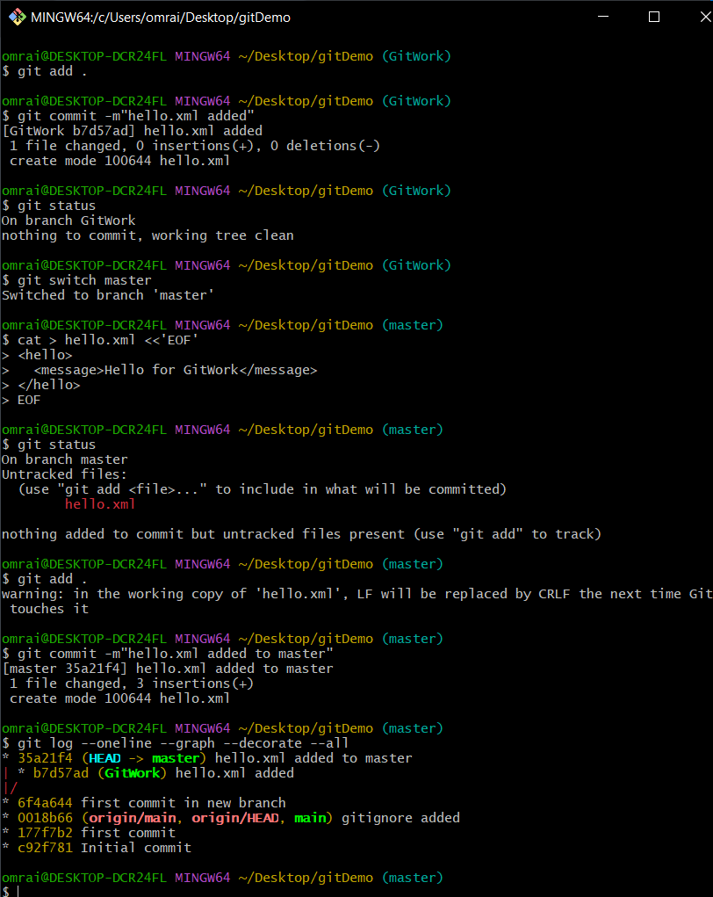
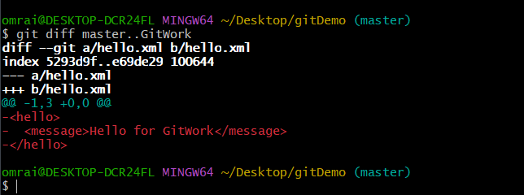
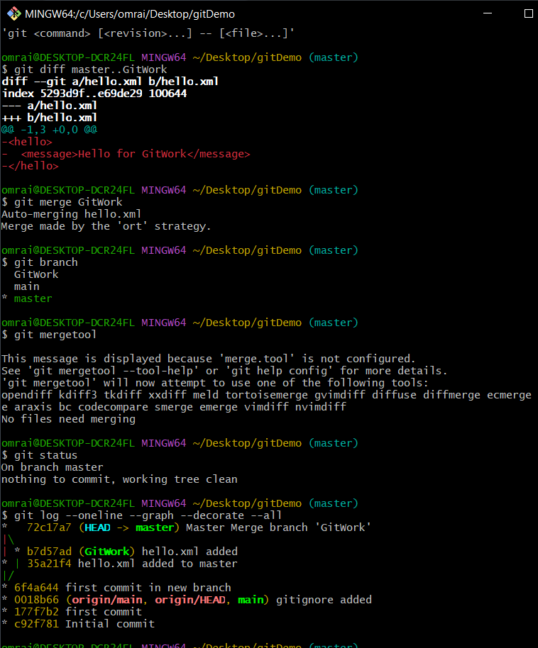
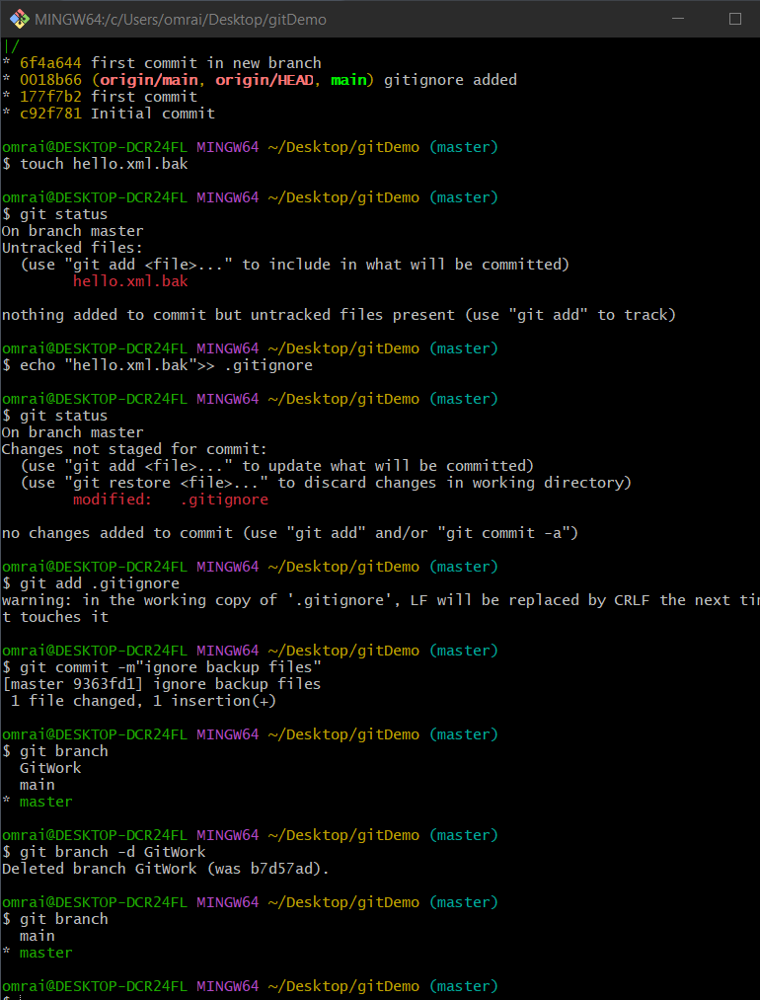

*  1.	Verify if master is in clean state.

* 2.	Create a branch “GitWork”. Add a file “hello.xml”.
* 3.	Update the content of “hello.xml” and observe the status
* 4.	Commit the changes to reflect in the branch
* 5.	Switch to master.

* 6.	Add a file “hello.xml” to the master and add some different content than previous.
* 7.	Commit the changes to the master
* 8.	Observe the log by executing “git log –oneline –graph –decorate –all”

* 9.	Check the differences with Git diff tool

* 11.	Merge the bran to the master
* 12.	Observe the git mark up.
* 13.	Use 3-way merge tool to resolve the conflict

* 14.	Commit the changes to the master, once done with conflict 
* 15.	Observe the git status and add backup file to the .gitignore file.
* 16.	Commit the changes to the .gitignore
* 17.	List out all the available branches
* 18.	Delete the branch, which merge to master

