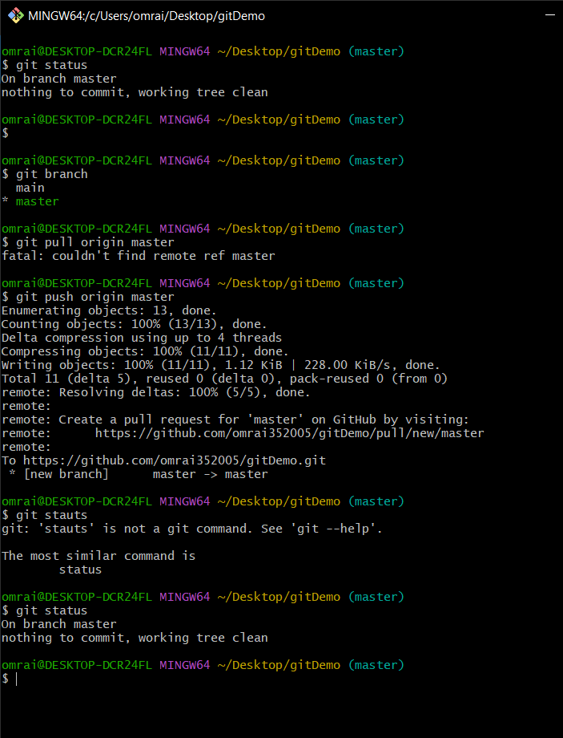
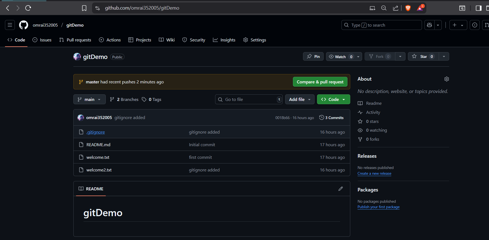
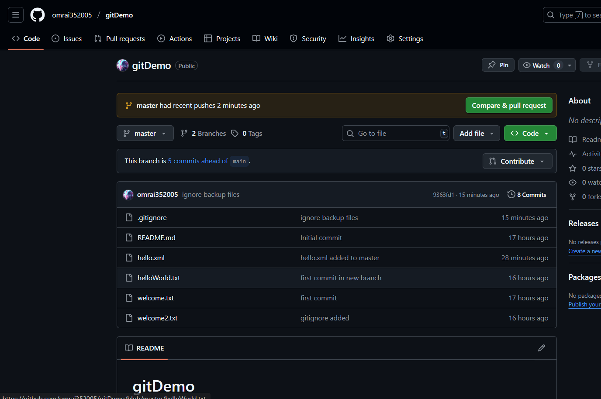

* 1.	Verify if master is in clean state.
* 2.	List out all the available branches.
* 3.	Pull the remote git repository to the master
* 4.	Push the changes, which are pending from “Git-T03-HOL_002” to the remote repository. 
* 5.	Observe if the changes are reflected in the remote repository.

### Remote Repositary 

* Main Branch 

* Master Branch 

## every thing up to date :) 