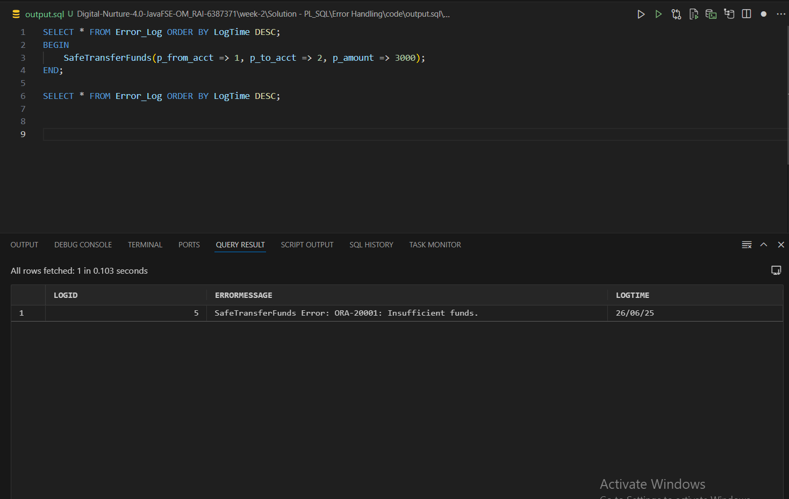
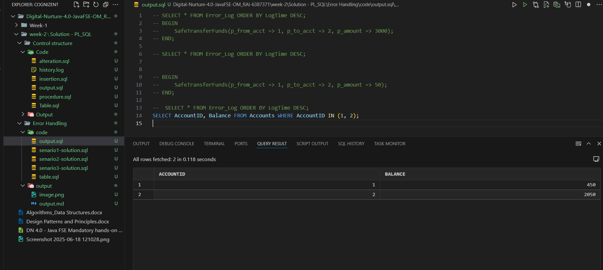
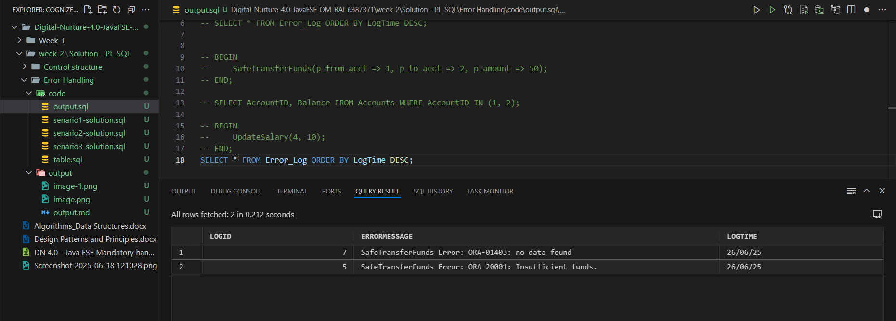
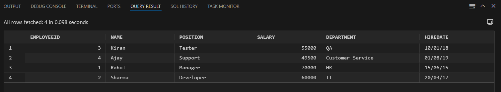
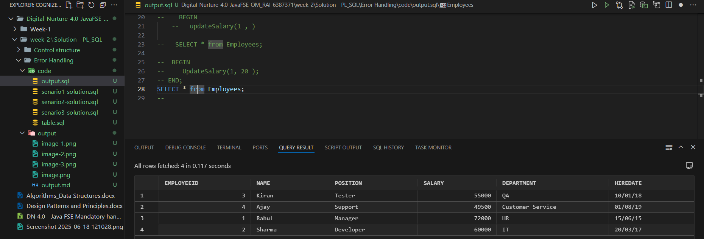
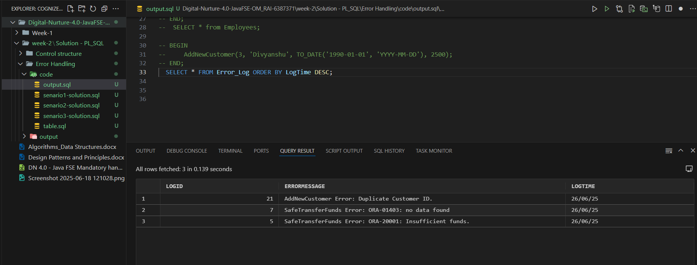
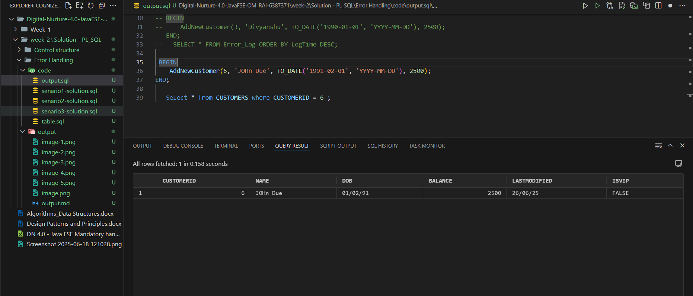

# Scenario 1 outputs

**Error**

**working**

# Scenario 2 outputs 

**Error**

**working**

previous salary of employee 1 is 60000

updated salary of employee 1 is 72000 i.e. 20 percent rase 

# Scenario 3 Outputs 

**Error** 

**working** 

